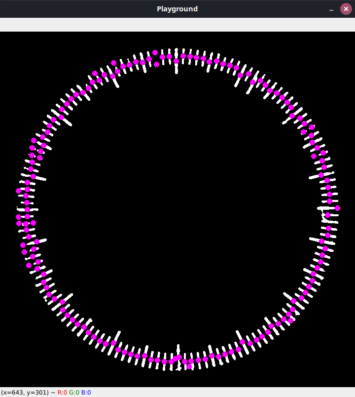

# solid-memory
This is a side project that I'm making for work where I need to calibrate a lot of dial indicators, which would require a lot of image processing since the dial indicators are the cheap kind that doesn't use any sort of electronics to measure distance.

This is very much a side project that will be worked on-and-off through my spare time and have no clear direction, but hopefully once more features are added, this readme will include more information.

# Screenshot
Well, first of all, this window is created by a testing script that I have for playing around in and this is not yet in the software, but the pink circles in the image are the graduations found on a dial indicator face.

# How to run
This software is mostly developed in python and opencv under linux enviroments so Mac and Windows platforms I don't care about.

## Prerequesits
1. Have python 3 installed ofcourse, since python 2 is long since EOL.

2. Install packages from requirements.txt

3. Have sanity to go through my code dumps that are without a lot of comments currently. (working on fixing this slowly)

# Files

`src/reading.py` is the current program where things are getting developed and getting things to extract angles and such between lines on the dial face. Lots of comments to be written to document the software there yet to come, but main place where you will see things happening.

`src/sensing.py` This was version 1 of the program that was made, but due to better comments, it's staying around for right now until I have documented the whole of reading.py and then this file will be basically bulldozered and rebuilt with the main logic of the program and maybe some fanzy Qt UI if I ever can get to grips to understand how that works.

`src/hardware/focusing.py` This is the file that I will be experimenting with in order to make a focusing system that actually works with my webcam for getting really up close to a dial indiactor. Currently I've just placed some code in there to remind me of the workflow I'm gonna be using, but right now it's not even close to complete.

`src/background_remover.py` This part will be the one that removes the background and only brings forth the needle that the dial indicator will be showing, which will later on extract a image of the needle using the foreground mask to extract the needle from the captured image from the webcam. This will probably come after I've fixed focusing.py and I've done a fixture to hold a dial indicator in.

`src/helper.py` This is where generic functions that will be used a lot in different files all over the place will be placed. It currently has some specific code, but it will be moved later on.

`test/test_helper.py` This is the current test harness that I have so far written for `src/helper.py`. More testing code will follow as I uncover mistakes I make in my code to make sure I won't repeat those mistakes. Also, not all functions or code is tested due to me moving away from scaling and some other stuff.

## Image files

|Filename|Description|Current state|
|---|---|---|
|`dial.jpg`|This is a closeup of a Mitutoyo dial indiactor I took with my camera and macro lens in hopes that I would be able to use it to test my program out on.|Currently unused due to techical problems|
|`dial_2.jpg`|Another closeup of the same Mitutoyo dial indiactor, but this time it had a white paper behind it to help filter out the background in the program.|Currently unused due to processing times, but `dial_face.jpg` was extracted from this image|
|`dial_face.jpg`|This image is a closeup of the dial indicator face generated from `dial_2.jpg` but this is also a smaller image so it gets processed much faster which is the main reason it's used to test basically everything right now.|Actively used a lot|
|`dial_face_720p.png`|This image is basically the same as the normal `dial_face.jpg` file, except scaled to 720p due to experimenting taking a long time processing such large photos, and which basically all the program will use to test itself against from now on|